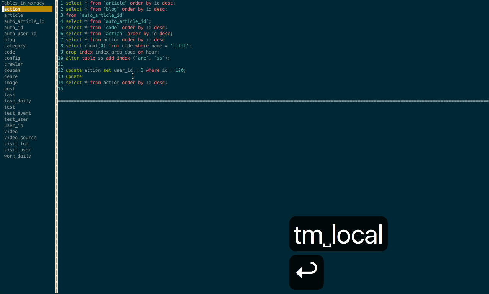

# Terminal Mysql
Mysql client like vim in terminal

Terminal Mysql 像 Vim 一样在 Terminal 中使用 Mysql 客户端

## 演示




## 下载

### Go

```bash
$ go get github.com/wxnacy/tm
```

### Mac

```bash
$ wget https://github.com/wxnacy/tm/blob/master/bin/darwin_amd64/tm?raw=true -O tm && chmod +x tm && mv tm /usr/local/bin
```

### Linux

```bash
$ wget https://github.com/wxnacy/tm/blob/master/bin/linux_amd64/tm?raw=true -O tm && chmod +x tm && mv tm /usr/local/bin
```


## 更新日志

**0.3.1**
- 更新时间：2018-11-13
- 1、完善弹出框的时机及稳定性
- 2、results 区域增加左右移动的功能
- 3、修改 commands 区域 x 的 bug
- 4、commands 区域增加了一些配色
- 5、results 区域增加详情的提示框
- 6、results 修改结果为空时上下移动的 bug

**0.3.0**
- 更新时间：2018-11-11
- 1、增加输入表名出现提示框的功能
- 2、完善方向键对提示框的操作
- 3、修改退格键在换行时 bug

**0.2.0**
- 更新时间：2018-11-09
- 1、执行修改 sql 时完善 rows affected 数据
- 2、最后一位执行 ctrlw 有问题
- 3、修改 update 类型语句的错误处理
- 4、commands 区域增加了颜色区分
- 5、commands 增加了更多命令处理

**0.1.5**
- 更新时间：2018-11-08
- 1、commands 跳出后跳回的光标行数
- 2、修复区域扩大时光标会有问题
- 3、修改行数超过 commands 区域的执行问题
- 4、优化了查询大表时的展示时间
